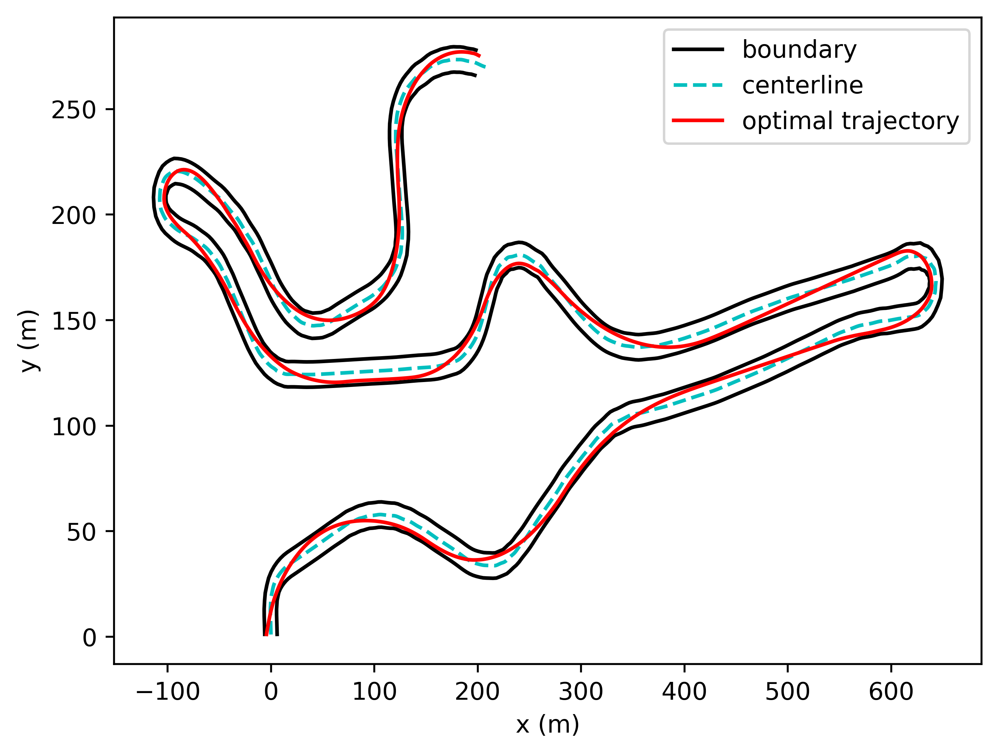

### Optimal Racing Line computation

Fork of [repository](https://github.com/TUMFTM/global_racetrajectory_optimization) for finding optimal trajectory for a race car on a race track.
This fork does two major updates:

- Incoroporates Single Track model.
- Incporates optimal trajectory computation for non-circular tracks.

This code has been tested with Python 3.8.16
The code for spline regression is contained in `trajectory_planning_helpers/spline_approximation_open.py`

1. Install packages.

```
pip install -r requirements.txt
```

2. Run code to calculate optimal trajectory and generate plots.

```
python3 main_globaltraj.py
```

3. The folder `outputs/mintime` contains the optimal controls and states, `outputs/track_bounds.csv` contains the track boundaries, `outputs/traj_rac_cl.csv` contains the optimal trajectory.

4. `plots.ipynb` contains the plots used in the report.


